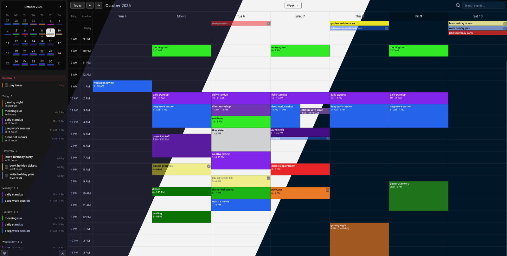
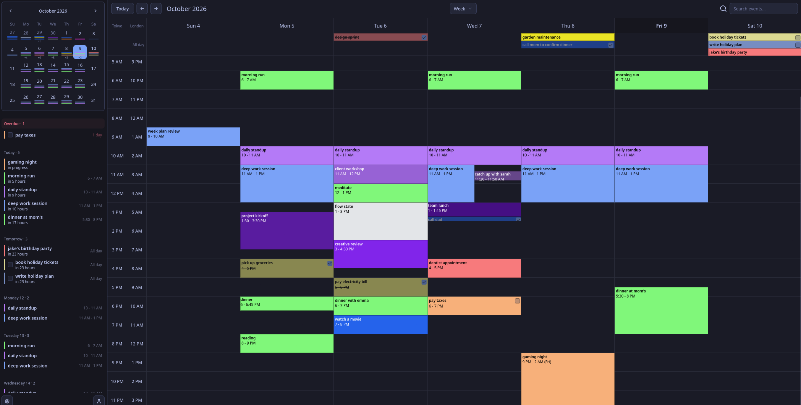

# acLife

acLife is a personal organizer with end-to-end encryption. It currently includes a calendar with tasks, available as a web app and as a desktop app. A journal is planned.

Events and settings are encrypted on your device before they are uploaded, so the server only stores encrypted data.

<p align="center">
  
</p>

## Project status

acLife is at version 0.1.0 and is in early development. Expect bugs and breaking changes between versions.

The app has been in active use for several months without data loss or major issues, but that can't be guaranteed. Back up your data every now and then.

The calendar and tasks are implemented. The journal is not built yet.

## Try acLife

You can try acLife at [atrxis.com/acLife](https://atrxis.com/acLife), either for free in offline mode or by registering an account on the hosted service for a small fee.

acLife is fully open source. Offline mode and self-hosting are free and include every feature. The fee on the hosted service only covers running it: data storage and device sync.

## Features

### Calendar and tasks

- Day and week views, a mini-calendar, and an agenda list that shows overdue items
- Create, move, resize, duplicate, copy and paste events, by mouse or keyboard
- Recurring events (daily, weekly, monthly, yearly), with edits and exceptions for single occurrences
- Tasks that can be marked complete, including single occurrences of repeating tasks
- All-day events, colors, descriptions and time zones
- Undo and redo
- Search across the whole calendar
- Event notifications by sound, device notification, or both

### Privacy and security

- Events and settings are encrypted with AES-GCM using a random master key. The master key is protected by your password with Argon2id.
- Login uses SRP, so your password is never sent to the server.
- Events are filed under hashed week buckets, so the server can return the weeks you are viewing without knowing which dates they are.
- You can unlock with your password, a PIN, or stay unlocked on a device. The desktop app protects PINs with the operating system keychain.
- Offline mode works without an account or a server. Data is encrypted and stored in the browser or desktop app.
- The server limits login attempts and registrations, and lets you review and revoke active sessions.

### Sync and devices

- Changes sync live between your devices.
- Settings sync too, and you choose which settings are synced and which stay on the device.
- A web app, and a desktop app for Windows, Linux and macOS with native notifications and automatic updates.

### Customization and accessibility

acLife is highly customizable. See the settings pages for the full list.

- More than 25 built-in themes, in light and dark variants, with your own colors and fonts
- Custom CSS
- Week start, time and date formats, hour height, event appearance and many other calendar options
- English, Spanish, French, Polish, Japanese, Chinese, Hindi and Arabic, with right-to-left layout
- Keyboard navigation and screen reader support, checked by automated accessibility tests

<p align="center">
  
</p>

## Technology

| Part | Stack |
|---|---|
| Web client | React 19, TypeScript, Vite, Tailwind CSS 4, shadcn/ui and Radix |
| Desktop app | Tauri 2 (Rust) around the same client |
| Server | Go, REST API with an SSE stream, MariaDB/MySQL |
| Auth and crypto | SRP, Argon2id, AES-GCM, HKDF and HMAC-SHA256 via the Web Crypto API |
| Payments | Stripe (optional) |
| Notifications | Web Push (VAPID) and native desktop notifications |
| Tests | Vitest and Testing Library on the client, Go's `testing` on the server |

## Downloads

- **Desktop app**: installers for Windows, Linux and macOS are on the [releases page](https://github.com/atar4xis/acLife/releases). Releases are GPG-signed and come with checksums. The signing key is in [`KEYS`](KEYS).
- **Server**: server binaries are attached to each release as well.

## Repository layout

```
client/   web client and Tauri desktop app
server/   Go API server
```

Setup, configuration, building and development details are in the [client README](client/README.md) and the [server README](server/README.md).

## Contributing

If you find a bug or have a feature suggestion, please open an [issue](https://github.com/atar4xis/acLife/issues).

## License

acLife is licensed under the [GNU General Public License v3.0](LICENSE).
